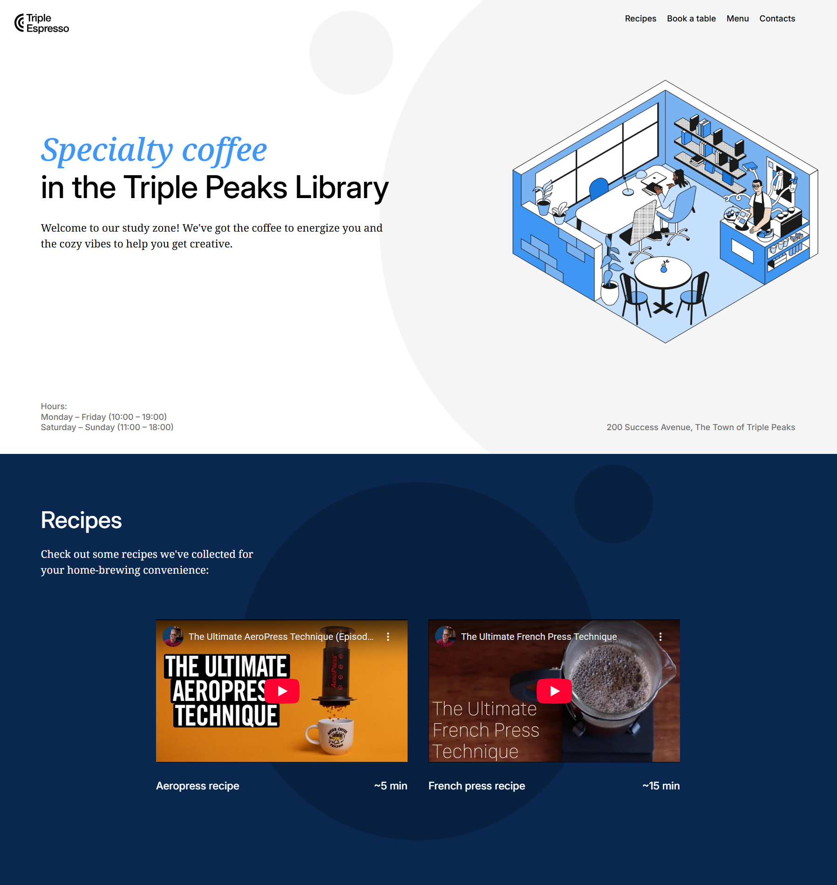
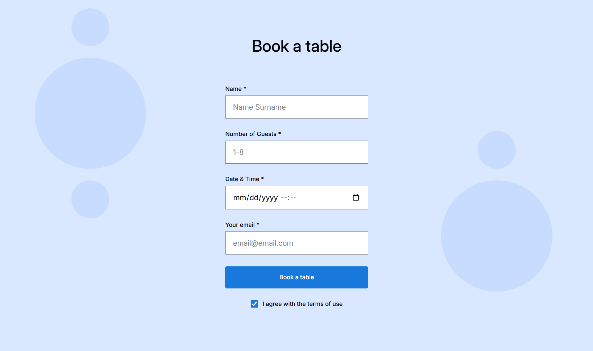
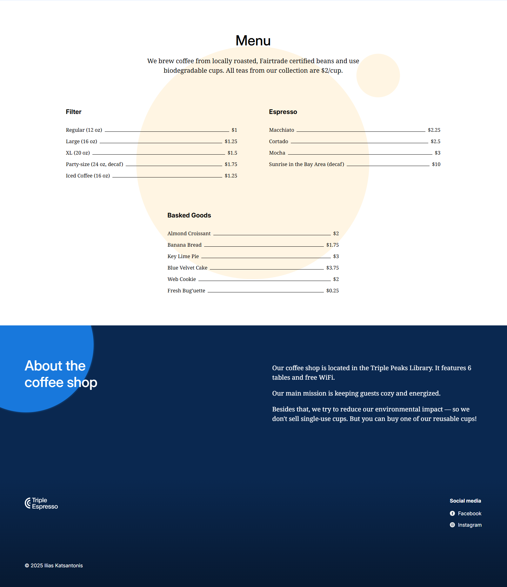

git# React + Vite

This template provides a minimal setup to get React working in Vite with HMR and some ESLint rules.

Currently, two official plugins are available:

- [@vitejs/plugin-react](https://github.com/vitejs/vite-plugin-react/blob/main/packages/plugin-react) uses [Oxc](https://oxc.rs)
- [@vitejs/plugin-react-swc](https://github.com/vitejs/vite-plugin-react/blob/main/packages/plugin-react-swc) uses [SWC](https://swc.rs/)

## React Compiler

The React Compiler is not enabled on this template because of its impact on dev & build performances. To add it, see [this documentation](https://react.dev/learn/react-compiler/installation).

## Expanding the ESLint configuration

- **Menu**  
  A multi-column café menu built with Flexbox, list dividers, and BEM classes.

- **About / Contacts**  
  Provides information about the café and includes animated decorative elements created with CSS keyframes.

## Project features

- Semantic HTML5
- Flexbox
- Positioning
- Flat BEM file structure
- JavaScript form validation
- CSS animation and transform

## Project Preview

### Homepage & Recipes

### Reservation Form

### Menu & Footer

## GitHub Page

https://iliascka.github.io/coffee-shop-website/
